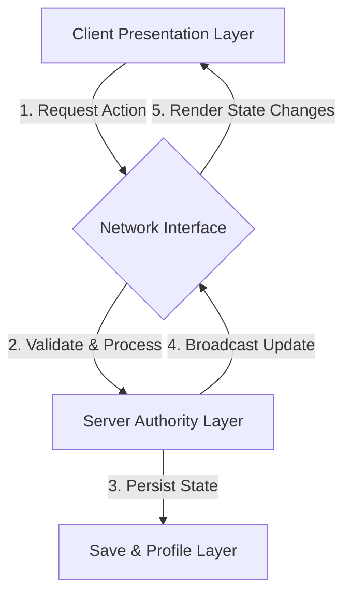

# Technical Architecture - Bigger

This document conceptually outlines the architecture, responsibilities, and data boundaries of the Bigger project. It is implementation-agnostic and does not bind development to specific APIs.

---

## System Architecture

Bigger follows a strict Server-Authoritative design patterns where the client serves as a visual and input presentation layer, while the server acts as the absolute source of truth.

---

## Layer Responsibilities

### 1. Client Layer (Presentation)
- **Responsibilities**:
  - Capturing and responding to player input (movement, UI interactions).
  - Simulating and displaying local visual scales (smoothly transitioning player size animations).
  - Playing visual effects (VFX), particle systems, sound effects (SFX), and UI indicators upon object destruction.
  - Rendering player-facing interfaces (Lobby UI, shop menus, portal entry prompts).
- **Constraints**:
  - The client must never calculate rewards, modify stats directly, or determine if a portal requirement is met. It must request these actions from the server.

### 2. Server Layer (Authority)
- **Responsibilities**:
  - Maintaining player progression states (authoritative Size, Destruction, Rebirths, and Upgrades).
  - Validating all client requests (e.g., verifying if the player actually has enough Size to destroy an object or enter a portal).
  - Executing physics checks and distance validation to prevent teleportation exploits or wall-clipping during object interactions.
  - Handling lobby teleports and zone transfers.
  - Granting currency and upgrades upon successful validations.
- **Constraints**:
  - All critical mathematical calculations (growth increments, cost requirements) must execute authoritatively on the server.

### 3. Network Layer (Communication)
- **Responsibilities**:
  - Facilitating decoupled communication between the Client and Server.
  - Exposing unidirectional message channels (Requests and Updates).
- **Communication Pattern**:
  1. **Request**: Client fires a request to execute an action (e.g., "RequestDestroy", "RequestRebirth").
  2. **Validation**: Server intercepts, checks parameters/state, and computes the new state.
  3. **Update**: Server broadcasts or sends a direct update payload containing the new state.
  4. **Render**: Client listens to the update and updates local visuals/UI.

### 4. Data Layer (Persistence)
- **Responsibilities**:
  - Safely loading, caching, and saving player states.
  - Handling session lifecycle events (player joining, playing, autosaving, leaving, and server shutdown).
  - Processing offline progression metadata.
- **Constraints**:
  - **Source of Truth (Server Memory)**: During gameplay, player profiles are cached and managed entirely in **Server Memory**. Client-facing indicators, folders, or structures (such as `PlayerGui`, `leaderstats`, or Roblox `Attributes`) are presentation-only properties. They must **never** be treated as the Source of Truth.
  - Persistence: Database writes occur only via the designated persistence loop (autosave, logout, or server shutdown).

---

## Runtime Execution

For a detailed breakdown of how systems function at runtime, including execution principles, state machines, session management, world instantiation, and instance pooling mechanisms, refer to the [RUNTIME.md](file:///f:/BIGGER/docs/RUNTIME.md) specification.

---

## Architectural Decision Records (ADRs)

Key architectural decisions made throughout the life of the Bigger project are documented in detail:
- [ADR-001: Private World Instances](file:///f:/BIGGER/docs/adr/ADR-001_private_world_instances.md)
- [ADR-002: Destruction Replaces Wins](file:///f:/BIGGER/docs/adr/ADR-002_destruction_replaces_wins.md)
- [ADR-003: Extension First Framework](file:///f:/BIGGER/docs/adr/ADR-003_extension_first_framework.md)
- [ADR-004: Server Memory Source of Truth](file:///f:/BIGGER/docs/adr/ADR-004_server_memory_source_of_truth.md)

