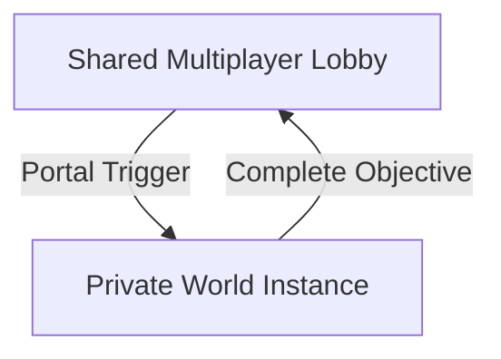
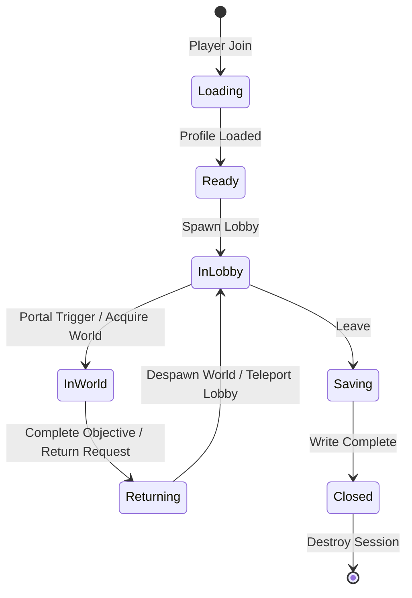
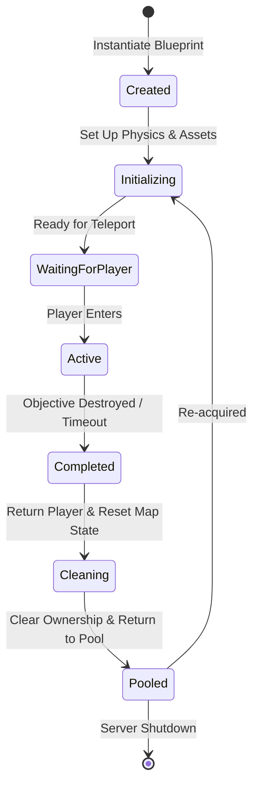

# Runtime Architecture - Bigger

This document outlines the conceptual runtime framework, player sessions, world instantiation, pooling strategies, and structural philosophy for the Bigger project. It is implementation-agnostic, describing how the game exists and behaves while running, without defining specific Luau code, API signatures, or game balancing metrics.

---

## Runtime Principles

These core principles govern how state and lifecycle are managed within the runtime environment:

- **Everything has one owner**: Every runtime object, resource, or state chunk must have a single designated owner (e.g., a service, a player session, or a world instance). Ownership must be explicit and clear.
- **Everything has one lifecycle**: Every entity must have a predictable, well-defined lifecycle (creation, initialization, active execution, cleanup).
- **Everything can be cleaned up**: No system should leave dangling objects, event connections, or references. Memory and instances must be safely freed.
- **Nothing lives forever**: All temporary states, instances, or caches must have a defined destruction or pool-return pathway.
- **Runtime state never exists without an owner**: State cannot exist in isolation; if its owner is destroyed, the state must be automatically garbage collected or cleaned up.

---

## Framework Design Goal & Extension-First Philosophy

The runtime framework prioritizes **long-term extensibility** over short-term implementation speed. Core systems should rarely require modification after their initial release.

### Core Design Rules:
- **Stability of the Core**: Core runtime services (e.g., session handling, basic growth ticks, save handlers) must remain stable and unchanged across future content updates.
- **Data-Driven Content**: New gameplay zones, upgrade tiers, and progress checkpoints must be introduced entirely through configuration, definitions, and components rather than system code rewrites.
- **The Extension Test**: Whenever a new feature is proposed, developers (and AI assistants) must ask:
  > *"Can this feature be implemented by extending existing systems via components or configuration, without modifying the Core runtime?"*
- **Architecture First**: If a proposed gameplay feature cannot be implemented cleanly by extension, the core architecture itself must be refactored and improved *before* the feature is built. Core systems should not be patched with ad-hoc workarounds.

---

## Architectural Isolation: Reusable Core vs. Replaceable Game

To ensure long-term architectural stability, the project enforces a strict separation of concerns between structural mechanics and specific gameplay themes:
> **Core is reusable. Game is replaceable.**

### Core Framework (Theme-Agnostic Engine)
Core elements are entirely agnostic to the game's theme, objects, and visual progression milestones. The following core elements must **never** contain references to specific content concepts (e.g., `Protein`, `House`, `Car`, `City`, or even `Destruction` directly):
- `SessionService`
- `SaveService`
- `WorldInstanceService`
- `WorldPoolService`
- `Core/Runtime`
- `Core/Pool`

### Game & Content Layer (Theme-Specific Implementation)
The specific gameplay concepts are treated as data, configurations, and component extensions:
- **Core Abstractions**: Core exposes generic structures like "player sessions", "numeric resource tokens", "world zones", "objectives", and "multipliers".
- **Game Mapping**: The game layer maps these core abstractions to thematic parameters:
  - Numeric tokens map to `Size` and `Destruction`.
  - Rebirth parameters map to cost tables.
  - WorldInstance maps load specific map models (like `City` or `Forest`).
  - Active objectives load models containing specific items (like `House` or `Car`).

- **Value**: This clean split allows developers to repurpose the entire Core framework for an entirely different Roblox simulator project (e.g., swapping a Growth Simulator for a "Mining Simulator" or "Shrink Simulator") by replacing only the definitions, configurations, and visual assets, without changing a single line of Core runtime engine code.

---

## Architecture Flow: Lobby to Private World


Bigger adopts a pattern where the player moves between a shared social environment and private gameplay zones:



### Key Advantages of this Architecture
- **No Resource Contention**: Players play in their own private instances, meaning objects cannot be stolen or destroyed by other players.
- **Simplified State Syncing**: Destruction state is entirely local to that player's private world instance. The server does not need to synchronize object-destruction physics or visuals across multiple players.
- **Precise Balancing**: The server can balance reward progression and task requirements cleanly per-player without interference from others.
- **Instance Recycling**: Map instances are not constantly cloned and discarded; they are recycled via a pooling system.
- **Social vs. Gameplay Separation**: Players maintain a multiplayer social experience while in the Lobby (seeing other players, trading upgrades, comparing progress) but enjoy a focused, latency-free individual experience during gameplay.
- **Roblox-Server Authoritative Alignment**: Players remain on the same Roblox server (no reserved servers or TeleportService latency) but play within isolated spatial zones, keeping execution fast, safe, and authoritative.

---

## Runtime State Machines & Lifecycles

### 1. Server Lifecycle
The execution sequence of the server from boot to termination:

```
Server Boot
    ↓
Initialize Core (Setup core namespaces and utility layers)
    ↓
Load Config (Read static world definitions, portal thresholds, etc.)
    ↓
Initialize Services (Spawn core runtime services in dependency order)
    ↓
Ready (Signal server availability)
    ↓
Accept Players (Begin handling incoming player sessions)
    ↓
Gameplay (Runtime processing loop)
    ↓
Shutdown (Flush profiles, save states, clean up services)
```

### 2. Player Session States
A player's session state tracks their current load status and physical location. This state machine resides in server memory, allowing quick lookups without querying workspace objects:



- **Loading**: Fetching persistent player data from the data store.
- **Ready**: Data loaded; session memory initialized.
- **InLobby**: Player is in the shared social lobby area.
- **InWorld**: Player is inside their private `WorldInstance`.
- **Returning**: Objective completed; cleaning up world state and preparing lobby teleport.
- **Saving**: Writing the final session state back to the persistent database.
- **Closed**: Memory cleared; session discarded.

### 3. WorldInstance States
Each private world instance moves through a strict lifecycle to manage setup, gameplay, and recycling:



- **Created**: World instantiated or duplicated from blueprint template.
- **Initializing**: Instantiating destroyable objects, resetting physics, loading initial configurations.
- **WaitingForPlayer**: Map is ready; server awaits player teleportation.
- **Active**: Player is active in the world; game logic running.
- **Completed**: Player has successfully destroyed the main objective or left the world.
- **Cleaning**: Returning player to the lobby, clearing temporary assets, resetting objects.
- **Pooled**: Resting in memory pool, ready to be assigned to another session.

---

## World Definitions & Instances

To decouple static configuration from dynamic execution, we separate worlds into two concepts:

- **WorldDefinition**:
  - An immutable, data-driven blueprint.
  - Contains configuration properties: world theme, map model references, required entry sizes, reward parameters, and configurations for destroyable objects.
  - Read-only at runtime.
- **WorldInstance**:
  - A mutable, active gameplay instance.
  - Represents the physical zone where the player is currently playing.
  - Tracks transient session properties: current owner player, objective status, active transient assets, and the elapsed duration.

---

## Instance Pooling Philosophy

To optimize memory utilization and avoid CPU spikes from frequent instantiation/destruction, Bigger utilizes **Instance Pooling**.

Instead of continuously spawning maps, UI panels, VFX, or projectiles using Roblox `Clone()` and `Destroy()`, objects are recycled:

```
Acquire (Claim from pool) -> Reset (Re-initialize state/assets) -> Reuse (Active play) -> Release (Return to pool)
```

### Scope of Instance Pooling
Instance pooling is the default runtime strategy for:
- **WorldInstances**: Private zone models and their configurations.
- **Effects**: Spatial visual effects, indicators, and lighting.
- **Destroyables**: Reusable destructible components and meshes.
- **VFX & Projectiles**: Particle systems, cosmetic elements, and physics-driven entities.
- **Temporary UI**: Transient GUI elements, markers, and floating text.
- **Bosses / Mini-Bosses**: Reusable gameplay entities and AI anchors.

---

## Data Layers & Runtime Ownership Model

The project enforces a strict, hierarchical separation of data flow to keep the simulation decoupled from the rendering and persistence layers:

```
Persistent Data (Roblox DataStore)
        │
        ▼
  Server Memory (Authoritative session profile cache)
        │
        ▼
  Runtime State (Active world instances & transient states)
        │
        ▼
  Presentation (Visual instances, client UI, VFX, attributes)
```

### Data Layer Definitions:
- **Persistent Data**: Long-term state storage (e.g., Roblox `DataStore`). Loaded once at session start and written back during saving.
- **Server Memory**: The absolute source of truth for the player's session profile (Size, Destruction milestones, Rebirths). Resides purely in Lua memory tables.
- **Runtime State**: The temporary, active state of the current gameplay environment (e.g., specific `WorldInstance` properties, active objectives, timer counts). Discarded or reset when the world returns to the pool.
- **Presentation**: Visual reflections of the underlying data (e.g., `PlayerGui`, `leaderstats`, Roblox instance `Attributes`, VFX). The client renders this data; the server never reads from it to execute logic.


### Ownership Matrix
To enforce a strict single-write-authority design pattern, runtime objects have clear owners. Only the designated service may write to or modify its associated runtime objects:

| Runtime Object | Owner Service | Description & Write Authority |
| :--- | :--- | :--- |
| **PlayerProfile** | `SaveService` | Owns persistent data. Directly loads, autosaves, and flushes data. |
| **PlayerSession** | `SessionService` | Coordinates the active player session life, player states, and location tracking. |
| **WorldInstance** | `WorldInstanceService` | Manages world allocation, state transition validation, and active world memory references. |
| **DestroyableObject** | `DestroyService` | Governs size-check validation and authoritatively changes object state from intact to destroyed. |
| **Portal** | `PortalService` | Checks boundary entry requirements and approves player teleport events. |
| **Config** | `ConfigurationService` | Decodes and caches immutable data structures (upgrade stats, world lists). Read-only for all other systems. |

### Presentation Separation
Client-facing visual and structural elements are **read-only outputs** of the authoritative state.
- `PlayerGui` (UI HUDs, progress bars, shop menus)
- `leaderstats` (Roblox's default leaderboard system)
- Roblox Instance `Attributes` (e.g., custom attributes on the player model)

These objects are updated to mirror the state computed in **Server Memory**. They must **never** be used by the server as a source of truth to check progression, validation, or resource tracking.

---

## Runtime Failure Handling

To maintain a robust and exploit-resistant server, systems must handle edge-case runtime failures gracefully. The focus is on achieving the desired conceptual outcome rather than specific code paths:

### 1. Player Disconnects While in a WorldInstance
- **Trigger**: Player exits the game mid-gameplay inside their private zone.
- **Desired Outcome**:
  - The `WorldInstance` must not become orphaned (leak memory or remain locked in use).
  - The player's active session state shifts immediately to `Saving`.
  - The `WorldInstanceService` detaches the player's ownership and marks the instance as `Completed`.
  - The world undergoes the `Cleaning` sequence and is returned to the pool for reuse.

### 2. Server Shuts Down While a WorldInstance is Active
- **Trigger**: Server receives a termination signal (e.g., developer update, Roblox crash).
- **Desired Outcome**:
  - All active player session states shift immediately to `Saving`.
  - The server processes emergency autosaves to preserve progress and prevent rollback.
  - Active `WorldInstance`s bypass the `Pooled` queue and undergo direct deletion to free system resources quickly during the shutdown sequence.

### 3. World Initialization Fails
- **Trigger**: A map fails to copy from pool, or required configuration markers are missing.
- **Desired Outcome**:
  - The creation sequence halts before the player is teleported.
  - The player session state reverts to `InLobby` (with a user-facing visual notification).
  - The faulty `WorldInstance` is quarantined or deleted, and a log alert is generated.
  - No player teleports into a corrupted world geometry.

### 4. Save Operation Fails
- **Trigger**: Network connection to the Roblox DataStore is rate-limited or fails.
- **Desired Outcome**:
  - The server maintains the profile in memory and retries the save using an exponential backoff loop.
  - The session state remains in `Saving` (or if during gameplay, keeps running on memory).
  - The player is not kicked unless the failure is persistent and memory limits are threatened.
  - Offline progression calculation matches the last successful save timestamp.

### 5. WorldInstance Cannot be Acquired (Pool Exhausted)
- **Trigger**: High player load, or worlds fail to recycle, resulting in an empty inactive pool.
- **Desired Outcome**:
  - The `WorldPoolService` dynamically creates a new `WorldInstance` on-the-fly rather than blocking the player.
  - A low-priority warning is sent to runtime diagnostics to adjust pool pre-allocation sizing.

---

## Proposed Core Runtime Folder Structure

```
Core/
├── Services/
│   ├── SessionService          # Manages player session loading, saving, and state tracking.
│   ├── WorldInstanceService    # Handles world allocation, ownership assignment, and teleport coordination.
│   ├── WorldPoolService        # Manages the inactive/active instance pool for maps and assets.
│   ├── SaveService             # Interfaces with the data store, handles autosaves, and profile flushes.
│   ├── GrowthService           # Processes size increments, rebirth resets, and upgrade multipliers.
│   ├── DestroyService          # Validates and executes object destruction and reward payouts.
│   ├── PortalService           # Evaluates portal access requirements and triggers zone transfers.
│   ├── NetworkingService       # Handles client-server network requests, checks, and state broadcasts.
│   └── ConfigurationService    # Manages data-driven definitions (worlds, upgrades, portals).
├── Components/                 # Decoupled behaviors attached to physical models (e.g., Destroyable).
├── Systems/                    # Server-side gameplay logic loops (e.g., Size gain ticks, idle rewards).
├── Config/                     # Static game configurations, world definitions, and constants.
└── Utilities/                  # Helper modules (e.g., Time helpers, math utilities, loggers).
```

---

## Core Runtime Services

The runtime services represent the foundational engine of the game.

> [!NOTE]
> This list represents the minimum runtime services required for the MVP. Additional services (such as `AudioService`, `AnalyticsService`, `EffectsService`, `TutorialService`, or `EventService`) may be introduced when justified by gameplay requirements.

### Service Responsibilities

#### 1. SessionService
- Creates, manages, and destroys `PlayerSession` objects.
- Exposes player session state checks (`Loading`, `Ready`, `InLobby`, etc.) to other services.
- Maintains in-memory caches of active player profiles.

#### 2. WorldInstanceService
- Coordinates the assignment of a `WorldInstance` to a player session.
- Handles spatial separation of world instances in the server environment.
- Interfaces with `PortalService` to handle transition triggers.

#### 3. WorldPoolService
- Spawns and maintains a pool of inactive `WorldInstance` templates in memory.
- Handles reclaiming, cleaning, and resetting maps back to their initial state.
- Reduces CPU overhead by serving pre-loaded assets.

#### 4. SaveService
- Coordinates data writes to persistent stores.
- Manages the periodic autosave loop for active player sessions.
- Safeguards player progression data during server crashes or unexpected shutdowns.

#### 5. GrowthService
- Handles authoritative calculation of player Size accumulation.
- Computes upgrade multipliers based on equipped `GrowthUpgrade` items.
- Processes player `Rebirth` requests (resetting Size in memory, granting rebirth points).

#### 6. DestroyService
- Validates that a player's size meets the requirement to destroy an object.
- Updates player stats (rewards size/destruction milestone) on validation success.
- Signals the networking layer to broadcast visual destruction effects to the client.

#### 7. PortalService
- Evaluates whether a player meets portal entrance requirements (Size, Destruction, Rebirths).
- Triggers transition requests to `WorldInstanceService` when a portal is successfully crossed.
- Blocks unauthorized portal interactions on the server.

#### 8. NetworkingService
- Wraps Roblox's RemoteEvents and RemoteFunctions.
- Decouples server logic from network endpoints.
- Validates and sanitizes all incoming client inputs.

#### 9. ConfigurationService
- Loads and parses game balance configuration tables (portal requirements, upgrade multipliers).
- Provides a centralized accessor for static read-only world parameters.

---

## Content-Driven Architecture

Bigger adopts a content-driven architecture to separate gameplay execution from physical assets and configuration. The system adheres to these boundaries:
- **Behavior belongs to Core**: All rules, physics validation, saving, growth, and destruction operations run within core runtime services.
- **Content belongs to Definitions**: World layouts and the association of models with specific behaviors are defined statically.
- **Configuration controls progression**: Balance data, scale multipliers, entry costs, and reward structures are defined in configurations.
- **Assets define presentation**: Visual meshes, sound effects, particle systems, and cosmetic values exist strictly to display state.

---

## Content Pipeline

Adding playable gameplay content requires zero modifications to the Core runtime. Content creators and AI agents must follow this linear pipeline:

```
Content Creator 
      ↓
  Model (Create physical asset in Roblox Studio)
      ↓
  Definition (Link the model and its properties in WorldDefinition)
      ↓
  Configuration (Define reward values and unlock cost thresholds)
      ↓
  Runtime Registration (Core systems automatically load & instantiate)
      ↓
Playable Content (Content is live and active)
```

- **Goal**: A developer or AI agent should be able to create a model, define its properties, and set progression variables without writing a single line of execution code.

---

## Scalability Goals & Framework Success Criteria

To measure the success of the runtime framework, the system must support content additions with zero core changes. 

### Framework Success Criteria Matrix
The following matrix defines the expected changes for typical updates. If a feature request forces a change to core services, it is a signal that the architecture is not yet sufficiently decoupled.

| Update Scenario | Expected Changes to Core Services | Modification Targets |
| :--- | :--- | :--- |
| **Add World** | **None** | Configuration files, World models / maps. |
| **Add Portal** | **None** | Configuration files, Portal models. |
| **Add Destroyable** | **None** | Model properties, WorldDefinition entry. |
| **Add Upgrade** | **None** | Configuration files. |
| **Add Reward** | **None** | Configuration files. |
| **Add Map Theme** | **None** | Visual models, textures, environmental config. |
| **Add Event World** | **None** | Configuration files, event world asset maps. |

> [!WARNING]
> If a feature request requires modifications to `WorldInstanceService`, `DestroyService`, `GrowthService`, or `SessionService`, the developer (or AI) must document a clear architectural justification explaining why the existing extension pathways were insufficient.

### Framework Stability Rule
If adding a gameplay feature requires modifying the Core runtime, the modification must be justified by a **reusable architectural benefit**, not by the specific requirements of a single gameplay feature.

- **❌ Violation**: Modifying `WorldInstanceService` to write custom boss-fight rules directly into the world loading logic.
- **✅ Compliant**: Extending `WorldInstanceService` to support customizable world objective components, allowing a "Boss World" to run as an objective component subclass without changing service logic.

---

## AI Constraints & Boundaries

To prevent scope creep and ensure the framework remains lightweight, the architecture maintains strict boundaries:

- **Strictly Implementation Agnostic**: The runtime defines structures and flows, not specific Luau frameworks (such as Knit, Roact/React, etc.) or APIs.
- **Server Authoritative**: All validations, state changes, and session management occur on the server. The client is strictly a rendering/input layer.
- **No Out-of-Scope Frameworks**: The following frameworks are explicitly excluded from the core architecture:
  - Combat / Weaponry frameworks.
  - Inventory / Item trading frameworks.
  - Quest / Dialogue trees.
  - Guild / Clan management.
  - Complex custom Skill / Talent trees.

---

## Evolution Principles

The Core runtime is expected to remain stable across the lifetime of the project. Future gameplay updates must be introduced by extending rather than modifying systems.

When implementing new gameplay features, developers and AI agents must adhere to the following preferred order of extension, moving to the next level only when the previous one is technically impossible:

```
    Configuration (Change data values or add upgrade keys)
          ↓
     Definition (Create new world lists or static entities)
          ↓
     Component (Create reusable behaviors attached to models)
          ↓
  Service Extension (Subclass or expose generic hooks in core services)
          ↓
  Core Modification (Refactor core system logic - LAST RESORT ONLY)
```

- **Extension-First Rule**: Core modifications are treated as a last resort. If a feature forces a Core modification, the primary task is to improve the extensibility of the core framework first, rather than patching in a narrow gameplay feature.

