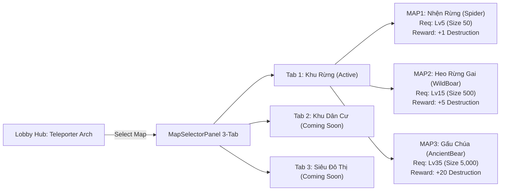
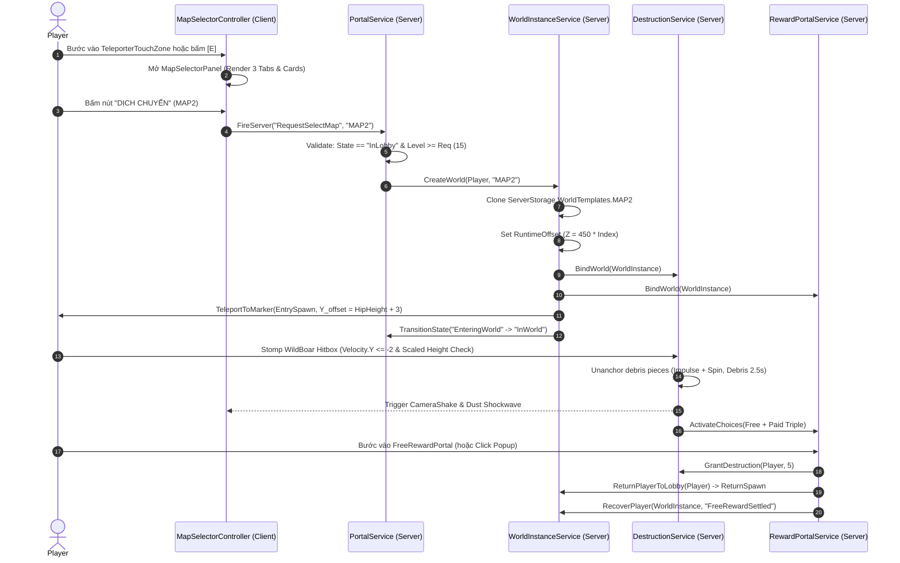

# Design Specification: MVP-007 Multi-Map Teleporter & Forest Zone (Maps 1-3)

**Date**: 2026-09-04  
**Milestone**: MVP-007  
**Status**: APPROVED IN GRILL-ME DESIGN INTERVIEW  
**Authors**: Senior Staff Architect (Fable Mode & System 2 Engine)

---

## 1. Executive Summary & Vision

Project **BIGGER** is an incremental Roblox simulator where players grow in physical scale (`Size`), step into isolated World Portals, destroy a single designated Main Object (`DestroyableObject`), earn permanent `Destruction` milestones ("Wins"), and reset temporary scale progression via `Rebirth`.

Task **MVP-007** introduces the generalized **Multi-Map Architecture**, the central **Teleporter Master Arch** in the Lobby, a responsive **3-Tab Map Selector GUI**, physical **Pre-Fractured Shatter FX**, and full content integration for the first biome: **Khu Rừng (Forest Zone - Maps 1 to 3)**.

---

## 2. Core Invariants (Architecture Freeze Compliance)

Every subsystem in MVP-007 strictly adheres to the following formal invariants:

| Invariant ID | Title | Formal Specification | Rationale & Proof |
| :--- | :--- | :--- | :--- |
| **`INV-01`** | Core Authority & Single Objective | $\forall \text{WorldInstance } w: |\text{Objectives}(w)| = 1 \land \text{State}(w) \in \text{ServerMemory}$ | Prevents partial states, cheating, and dungeon sprawl. |
| **`INV-02`** | Multi-Map Dynamic Gating | $\text{CanEnter}(p, m) \iff \text{Session}(p).\text{Bigger} \ge m.\text{RequiredSize} \land \text{Level}(p) \ge m.\text{RequiredLevel}$ | Verified by `tests/unit/mvp007_multimap_contracts.luau`. Server-enforced at `PortalService:SelectMap`. |
| **`INV-03`** | Scale-Adaptive Spawn Safety | $Y_{\text{offset}} = \max(\text{ConfigOffset}, \text{Humanoid}.\text{HipHeight} + 3)$ | Ensures giant avatars (up to 30x scale) land cleanly on `EntrySpawn` without floor clipping or flinging. |
| **`INV-04`** | Pre-Fractured Shatter Lifecycle | $\forall \text{Piece } c \in \text{Debris}: c.\text{CanCollide} = \text{false} \land \text{Lifetime}(c) \le 2.5\text{s}$ | Visceral physical destruction without server physics lag or collision jamming. |
| **`INV-05`** | Synchronized FTUE Milestone | $\text{Upgrade}[1].\text{DestructionReq} \le 2 \land \text{TierProgression} \propto \text{MapRewards}$ | Immediate progression speedup within first 60–120s of FTUE, eliminating early bounce. |
| **`INV-06`** | 3D Color Palette Atlas Invariant | $\forall \text{Mesh } m \in \text{BlenderExports}: \text{UV}(m) \subset \text{TextureAtlas}_{256\times 256} \land \text{DrawCalls}(m) = 1$ | 100% color parity in Roblox Studio without missing material links; optimal for mobile. |
| **`INV-07`** | Cross-Platform Input Invariant | $\forall \text{Action } a \in \text{UIPanels}: a \in \text{Touch} \land a \in \text{Keyboard(E/Esc)} \land a \in \text{Gamepad(A/B)}$ | Unified `ContextActionService` and `GuiService.SelectedObject` out-of-the-box navigation. |

---

## 3. Map & Content Hierarchy (Forest Zone: Maps 1–3)

The world hierarchy is partitioned into 3 distinct thematic tiers across 10 maps. Maps 1–3 are fully active in MVP-007; Maps 4–10 are defined with static metadata and marked `IsComingSoon = true`.



### Map Specification Matrix

| Map ID | Tên Quái / Objective | Cấp Yêu Cầu | Size Yêu Cầu | Thưởng Miễn Phí | Thưởng Paid (x3 - 29 R$) | Mô Hình 3D / Asset |
| :--- | :--- | :--- | :--- | :--- | :--- | :--- |
| **`MAP1`** | **Nhện Rừng (Forest Spider)** | Level 5 | 50 | **+1 Destruction** | +3 Destruction | `Spider.fbx` (Cephalothorax, Abdomen, 8 chân rời) |
| **`MAP2`** | **Heo Rừng Gai (Wild Boar)** | Level 15 | 500 | **+5 Destruction** | +15 Destruction | `WildBoar.fbx` (Thân, Đầu gai, 2 Ngà nhọn, 4 Chân) |
| **`MAP3`** | **Gấu Chúa Cổ Đại (Ancient Bear)** | Level 35 | 5,000 | **+20 Destruction** | +60 Destruction | `AncientBear.fbx` (Thân giáp đá, Đầu gầm, Vuốt đá) |
| `MAP4`-`MAP6` | Khu Dân Cư (Truck, Villa, Crane) | Level 60–150 | 25k–500k | +50 to +300 | +150 to +900 | Sắp ra mắt (`IsComingSoon = true`) |
| `MAP7`-`MAP10` | Siêu Đô Thị (Station, Tower, Mecha) | Level 220–500 | 2.5M–250M | +800 to +15,000 | +2,400 to +45,000 | Sắp ra mắt (`IsComingSoon = true`) |

---

## 4. Operational Workflow & Boundaries

| Responsibility | Owner | Scope & Deliverables |
| :--- | :--- | :--- |
| **GUI Design & Art** | **User (Human)** | Designs full UI in Figma, exports assets, imports layout hierarchy into `StarterGui`. |
| **GUI Logic & Responsiveness** | **AI Agent** | Scripts Luau controllers (`MapSelectorController.luau`), remote event bindings, CDRA responsiveness across Mobile, Tablet, Console, and PC. Provides temporary clean Mockups if Figma art is in-progress. |
| **Map Construction** | **User (Human)** | Builds room terrain, arena boundaries, walls, lighting, and environmental layout in Roblox Studio. |
| **3D Asset Generation** | **AI Agent** | Procedurally models production-ready 3D assets in Blender (objectives, props, foliage, architecture, doors). Applies 256x256 Color Palette Atlas, sets ground pivots ($Z=0$), and exports FBX to `blender/exports/`. |
| **QA & Verification** | **AI Agent** | Executes automated GameplaySimulator in Studio Play Solo with step-by-step frame capture (`screen_capture`) and F9 console auditing. |

---

## 5. Architectural Data Flow & State Machine



---

## 6. UI Architecture: Constraint-Driven Responsive Architecture (CDRA)

The `MapSelectorPanel` adheres to the CDRA standard established in `RebirthPanel`:

- **Master Container**: `MapSelectorPanel` (`AnchorPoint = (0.5, 0.5)`, `Position = (0.5, 0, 0.5, 0)`, `UIAspectRatioConstraint = 1.3502`, Background `#141826`, Corner 16px, Stroke 3px `#3C5078`).
- **Category Tabs Row**: 3 buttons on top:
  - `TabForest` ("Khu Rừng")
  - `TabResidential` ("Khu Dân Cư")
  - `TabMetropolis` ("Siêu Đô Thị")
  - Active Tab: Background `#19375F` (Transparency 0.2), Inactive Tab: Transparency 0.7.
- **3-Card Container**: Horizontal layout containing 3 large cards:
  - Card Header: Monster preview thumbnail (3D render).
  - Monster Name: FredokaOne, White with black stroke.
  - Requirement Badge: Neon Yellow (`#FFDC50`) with black stroke: `Lv. {X}`.
  - Reward Badge: Neon Green (`#20FF40`) with black stroke: `+{Y} Destruction`.
- **Bottom Action Bar**:
  - `TeleportButton`:
    - Qualified: Neon Green (`#20FF40`), Text "DỊCH CHUYỂN".
    - Under-leveled: Dark Grey (`#283246`), Text "YÊU CẦU CẤP {X}".
    - Coming Soon: Grey (`#1E2332`), Text "SẮP RA MẮT".
  - `CloseButton`: Top-right corner matching `RebirthPanel` close button artwork.
- **Multi-Platform Input Handling**:
  - `ContextActionService` maps `ButtonA` (Gamepad) and `Enter` (PC) to `TeleportButton`.
  - `ButtonB` (Gamepad) and `Escape` (PC) to `CloseButton`.
  - `GuiService.SelectedObject = TeleportButton` upon panel open for immediate console gamepad focus.

---

## 7. Progression Balancing & FTUE Calibration

To resolve the 50x grind bottleneck in the initial configuration, the progression curve is synchronized:

| Tier | Upgrade Name | Old Cost | **Calibrated Cost** | Additive Growth | Map Unlock Pairing |
| :---: | :--- | :---: | :---: | :---: | :--- |
| **1** | **Protein** | 50 Destr. | **1 Destruction** | +5 Growth/sec | Hoàn thành MAP1 lần đầu (1 Destruction) |
| **2** | **Silver Protein** | 500 Destr. | **5 Destruction** | +20 Growth/sec | Hoàn thành MAP2 lần đầu (5 Destruction) |
| **3** | **Gold Protein** | 2,000 Destr. | **20 Destruction** | +60 Growth/sec | Hoàn thành MAP3 lần đầu (20 Destruction) |
| **4** | **Diamond Protein** | 10,000 Destr. | **50 Destruction** | +200 Growth/sec | 2–3 lần MAP3 |
| **5** | **Emerald Protein** | 50,000 Destr. | **150 Destruction** | +650 Growth/sec | 7–8 lần MAP3 |
| **6** | **Ruby Protein** | 250,000 Destr. | **500 Destruction** | +2,000 Growth/sec | Cột mốc Rebirth 1 |

---

## 8. 3D Asset Standard: Color Palette Texture Atlas Pipeline

All 3D assets generated in Blender follow the **256x256 Color Palette Texture Atlas** standard (`blender/textures/TextureAtlas.png`):
1. **Palette Layout**: Flat 256x256 PNG containing 64 color swatches (greens, browns, dark greys, neon accents, fur tones).
2. **UV Mapping**: Mesh faces are unwrapped and collapsed into the corresponding pixel swatch on the palette texture.
3. **Topology**: Clean stylized low-poly (1,500 – 3,500 triangles per model) with smooth normals.
4. **Pivots**: Ground-contact objects have origins set at $Z = 0$ (ground level).
5. **Roblox Import Guarantee**: Models import with texture map linked directly to `MeshPart.TextureID`, guaranteeing 100% color fidelity and 1 single draw call per model.

---

## 9. Automated QA & GameplaySimulator Pipeline

Verification follows an automated, chronological GameplaySimulator timeline in Play Solo:

```text
[Step 1: Lobby Baseline] -> Verify Character Spawn & Scale 1.0 -> screen_capture()
       ↓
[Step 2: Approach Teleporter] -> ProximityPrompt / Touch Trigger -> screen_capture()
       ↓
[Step 3: MapSelectorPanel] -> Render 3-Tab, Cards, Console Nav -> screen_capture()
       ↓
[Step 4: Teleport to Arena] -> Scale-Adaptive Spawn Check -> screen_capture()
       ↓
[Step 5: Stomp & Shatter] -> Pre-Fractured Pieces Velocity + Camera Shake -> screen_capture()
       ↓
[Step 6: Settle Reward] -> Free Portal Touch -> +Destruction & Return to Lobby -> screen_capture()
       ↓
[Console Audit] -> get_console_output() asserts 0 Errors and 0 Warnings
```

---

## 10. Two-Stage Verification & Quality Gates

### Stage 1: Static & Contract Verification (Offline)
1. `stylua --check src/`: 0 formatting errors.
2. `selene src/`: 0 linter errors or warnings.
3. `lune run tests/unit/mvp007_multimap_contracts.luau`: 100% green passing all 7 test cases.

### Stage 2: Studio Play Solo Empirical Testing (Roblox Engine)
1. Launch Play Solo in Roblox Studio via MCP tool `start_stop_play`.
2. Run automated `GameplaySimulator` harness.
3. Capture sequential screenshots for visual delta comparison.
4. Audit F9 developer console: 0 errors, 0 memory leak warnings.
